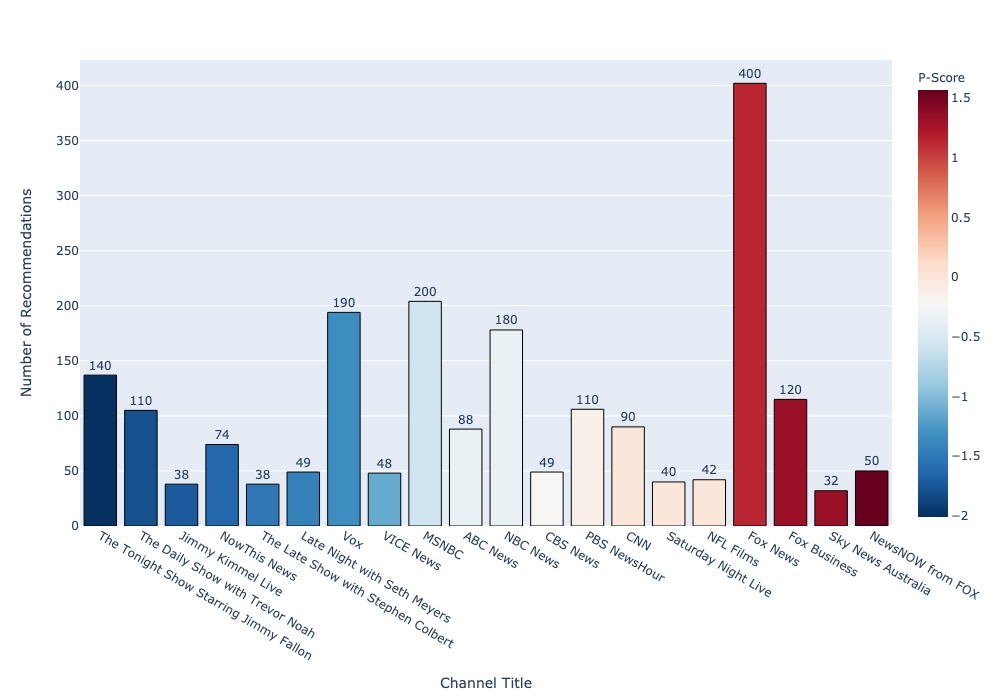
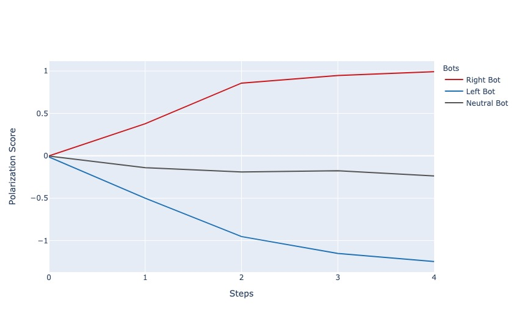
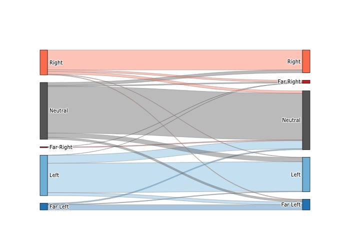

# Recommending Descent: YouTube and Political Polarization

Recommending Descent is my senior research thesis for UC Berkeley's Interdisiplanry Studies major. The project attempts to characterize the effect that political bias has on YouTube's video recommendation algorithm. This project uses three autonomous agents, or bots, to mock the behavior of a right-leaning, left-leaning, and apolitical YouTube user. The bots access videos through YouTube's [Data API](https://developers.google.com/youtube/v3). This repository contains all the code and data used for the project.

📑 [Paper](thesis.pdf) &nbsp; &nbsp;
📊 [Data](data) &nbsp; &nbsp;
🤖 [Code](script) &nbsp; &nbsp;
✏️ [Works Cited](https://www.notion.so/b6f79f445d534b1fa2384c4d74b3d416?v=2fdc95e61e5646c6b9c231844f1fde45) &nbsp; &nbsp;
🗂 [Recfluence Classifications](https://github.com/markledwich2/Recfluence)

## Abstract

This project attempts to determine the underlying causes of recommendation discrepancies for political content on YouTube. Much of the work on YouTube’s watch-next algorithm claims that the platform favors right-leaning political recommendations and consistently leads users down
"radicalization pipelines" of extreme content. To measure the validity of these claims, I used three autonomous agents, or bots, to collect and classify the political content of 3750 YouTube videos. Using a random-walk algorithm, these agents traversed YouTube’s video recommendation graph guided by conservative, liberal, and null bias, respectively. This research finds that left-leaning and right-leaning recommendations occur almost equivalently for users who select for these biases. This project also finds substantial qualitative differences in structure and content associated with left and right leaning video recommendations. These results suggest that radicalization pipelines are not unique to right-leaning content and that access to these pipelines are largely a user-driven phenomenon.

## Methods

The goal of this research is to capture the effect of user behavior on the output of YouTube’s recommendation algorithms using autonomous agents as proxies for actual users. These bots were designed to mock the content consumption and browsing behaviors of politically biased users. One bot represents a right wing partisan. This bot search’s for videos that have the highest level of right wing bias. Another bot represents a left wing partisan. This bot search’s for videos that have the highest level of left wing bias. Another bot will represent a content consumer with no political bias.

Each of the three bots in this project use a similar random-walk algorithm. The algorithm is described below:

<pre>
1. <b>Search</b>: Enter search query for a list of starting videos
2. <b>Collect</b>: Collect meta-data for videos
3. <b>Categorize</b>: Catagorize each video based on its political content
4. <b>Pick</b>: Pick the video with greatest level of favorable political bias
5. <b>Request</b>: Request 10 recommendations from the selected video
6. <b>Repeat</b>: Collect, categorize, pick, and request 4 more times
</pre>

Categorizations for this project were provided by Mark Ledwich and Anna Zaitsev's, [Recfluence Channel Classification Data Set](https://github.com/markledwich2/Recfluence#data). Each channel was also given a polarization score, or P-Score, representing the left/right-ness of each channel. Larger p-scores were given to more conservative channels and lower p-scores were given to more liberal channels.

For more information on methods, see the _Methods_ section in the [thesis paper](thesis.pdf).

## Findings

### Left/Right Network Topologies

This project finds significant differences in the kinds of recommendations offered to the Right, Left, and Neutral Bots. The majority of recommendations encountered by the Right Bot were to Fox News and Fox Business, with a small amount going to channels in the "Intellectual Dark Web". For the Left Bot, the majority of recommendations were to a more diverse pool of left-leaning media outlets like MSNBC, Vox, and late night shows. The Neutral Bot encountered a host of apolitcal and moderatelly political channels.

For more see \[[1](images/fig_7_1_0.jpeg 'All Channels Recommended Across All Trials')\] \[[2](images/fig_7_2_1.jpeg 'Top 40 Channels Recommended to the Right Bot')\] \[[3](images/fig_7_3_1.jpeg 'Top 40 Channels Recommended to the Left Bot')\].

### Divergent Recommendation Trends

Across the 5 random-walk steps, the three bots received increasingly different video recommendations. The Right Bot recieved recommendations that were increasingly more conservative, as measured by polarization score. The Left Bot recieved recommendations that were increasingly liberal and the Neutral Bot recieved recommendations that were slightly liberal but overwhelmingly apolitical.

For more see \[[4](images/fig_2_5.jpeg 'Recommendation Trends Across All Trials')\]

### Recommendation Catagory Proportions

The three bots also encountered varying proportions of political content recommendations. Most recommendations for the Right Bot went to Neutral, Right, or Far Right videos. The Left Bot received most recommendations between Neutral, Left, and Far Left videos. The Neutral Bot (above) received recommendations between all categories, with most recommendations occuring between Neutral videos.

For more see \[[5](images/fig_3_1_2.jpeg 'Left Bot Recommendation Proportions')\] \[[6](images/fig_3_2_2.jpeg 'Right Bot Recommendation Proportions')\] \[[7](images/fig_6_2.jpeg 'Recommendation Percentages')\].

## License

[MIT](https://choosealicense.com/licenses/mit/)
